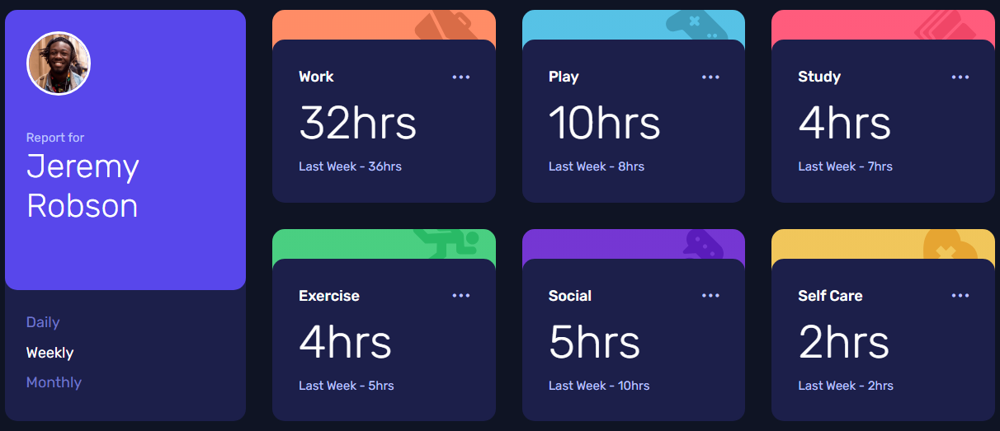

# Frontend Mentor - Time tracking dashboard solution

This is a solution to the [Time tracking dashboard challenge on Frontend Mentor](https://www.frontendmentor.io/challenges/time-tracking-dashboard-UIQ7167Jw). Frontend Mentor challenges help you improve your coding skills by building realistic projects.

### Screenshot

### Links

- [Solution URL](https://www.frontendmentor.io/solutions/time-tracking-dashboard-solution-using-css-grid-4jOyGarTs5)
- [Live Site](https://zxjklp.github.io/time-tracking-dashboard-main/)

### Built With

- Semantic HTML5 markup
- CSS custom properties
- Flexbox
- CSS Grid
- Mobile-first workflow

## Author

- Frontend Mentor - [@Zxjklp](https://www.frontendmentor.io/profile/Zxjklp)
- GitHub - [@Zxjklp](https://github.com/Zxjklp)
